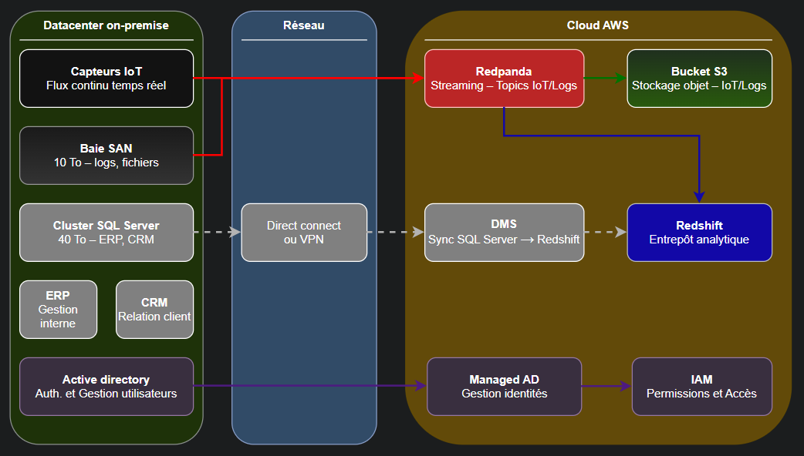
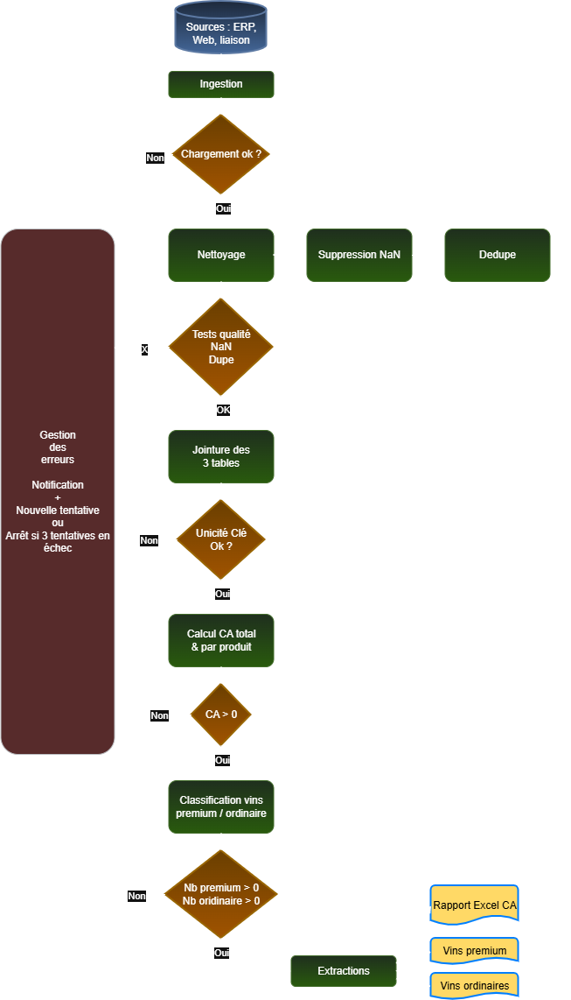
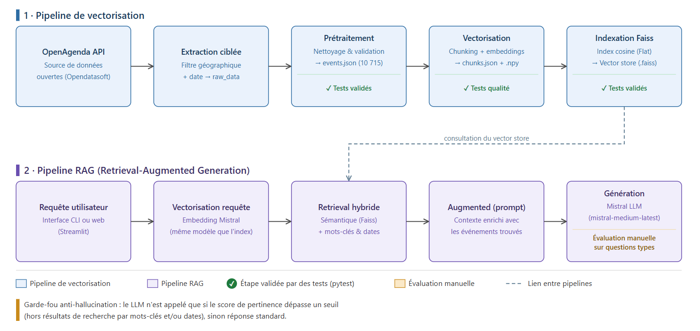
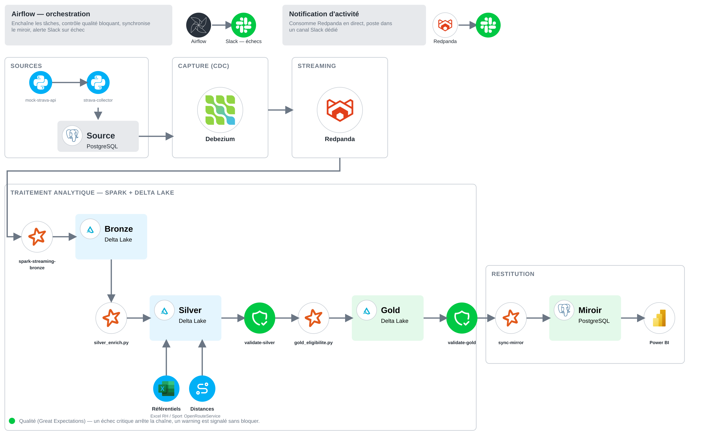

# Portfolio — Thomas Duc

**Data Engineer — ingestion, orchestration et systèmes IA de bout en bout, du POC à la mise en production.**

`Python` · `SQL` · `PySpark` · `Airflow` · `Kestra` · `AWS` · `Docker` · `LangChain` · `Faiss`

Récapitulatif des projets réalisés dans le cadre de la formation Data Engineer. Chaque section présente le contexte du projet, la stack technique utilisée et les résultats obtenus.

| Projet | Thème | Ce que ça prouve | Stack principale | Dépôt |
|---|---|---|---|---|
| [Projet 9](#projet-9--indutechdata) | Pipeline streaming temps réel et architecture cloud hybride | Conception d'architecture cloud chiffrée et argumentée | Redpanda, PySpark, Docker, AWS | Sur demande |
| [Projet 10](#projet-10--bottleneck) | Industrialisation d'un pipeline d'analyse de données | Pipeline testé étape par étape, planifié sans intervention manuelle | Kestra, DuckDB, Docker Compose | Sur demande |
| [Projet 11](#projet-11--puls-events-rag) | Chatbot de recommandation par recherche sémantique | Système RAG en production, évalué quantitativement | LangChain, Faiss, Mistral AI | [Dépôt](https://github.com/ThomasDx13/puls-events-rag) |
| [Projet 12](#projet-12--sport-data-solution) | Pipeline CDC avec architecture medallion | Architecture CDC/medallion avec versionnement des règles métier | Debezium, Redpanda, Spark, Delta Lake, Airflow | [Dépôt](https://github.com/ThomasDx13/sport-data-solution) |
| [Projet 13](#projet-13--étude-de-passage-du-poc-au-mvp-puls-events) | Étude de passage du POC au MVP | Pilotage de projet data : besoins, architecture, coûts, plan agile | Gestion de projet, AWS | Sur demande |

---

## Projet 9 — InduTechData

**Pipeline streaming temps réel fonctionnel + architecture cloud chiffrée (2 500 à 4 300 € de build, 260 à 350 €/mois d'OPEX)**

### Description

InduTechData est une entreprise du secteur industriel confrontée à une croissance de +50 Go/mois de données IoT, avec une infrastructure datacenter atteignant ses limites. Le projet couvre deux volets : la mise en œuvre d'un pipeline de streaming temps réel pour l'ingestion et l'analyse de tickets de support client, et une étude d'architecture cloud hybride pour accompagner la montée en charge des flux IoT.

### Stack technique

**Pipeline streaming** : Redpanda (broker compatible Kafka), PySpark 3.5.3 (Structured Streaming), Docker Compose (5 services : producteur, consommateur, broker, console de monitoring, initialisation).

**Architecture cloud proposée** : Amazon S3 (stockage objet), Amazon Redshift (entrepôt analytique OLAP), AWS DMS (synchronisation SQL Server vers Redshift), AWS Managed Microsoft AD et IAM (identités et accès), CloudWatch (supervision).

### Résultats et démonstration

- Pipeline fonctionnel de bout en bout : génération de tickets synthétiques, consommation en Structured Streaming, six analyses par batch (répartition par priorité, type de demande, équipe, top clients, tickets urgents), export Parquet
- Étude d'architecture chiffrée : investissement initial estimé entre 2 500 et 4 300 €, coûts récurrents de 260 à 350 €/mois, avec justification technique de chaque composant (scalabilité, interopérabilité, sécurité)
- Livrables : schéma d'architecture, document de justification technique détaillé, vidéo de démonstration

*Code et livrables disponibles sur demande.*

---

## Projet 10 — BottleNeck

**Pipeline industrialisé en 5 étapes testées, exécution mensuelle automatisée sans intervention manuelle**

### Description

BottleNeck, marchand de vin, disposait d'une analyse manuelle du chiffre d'affaires et de la classification des références premium/ordinaire, réalisée par un data analyst. L'objectif du projet était d'industrialiser ce processus pour une livraison mensuelle automatique aux responsables produits, en s'appuyant sur l'outil d'orchestration Kestra déjà retenu par la DSI.

### Stack technique

Kestra (orchestration, déclenchement planifié via cron), DuckDB (requêtes SQL sur fichiers), pandas (traitement Python), Docker Compose. Choix guidés par la légèreté et la facilité de débogage dans le contexte de la mission.

### Résultats et démonstration

- Pipeline en 5 étapes (ingestion, suppression des NaN, dédoublonnage, jointure, calcul du CA, classification), chacune verrouillée par un test bloquant avant de passer à la suivante
- Reprise automatique en cas d'échec (3 tentatives, 10 secondes d'intervalle), avec gestion d'erreurs centralisée
- Exécution planifiée le 15 de chaque mois à 9h, sans intervention manuelle
- Livrables produits : rapport de CA (Excel), extractions des vins premium et ordinaires (CSV)
- Bilan assumé en fin de mission : pipeline fonctionnel de bout en bout, tous les tests passent, mais alerting limité aux logs Kestra (pas de notification email) et absence de CI/CD sur les scripts, identifiées comme pistes d'amélioration

*Code et livrables disponibles sur demande.*

---

## Projet 11 — Puls-Events RAG

**12 643 chunks indexés, recherche vectorielle en 16,33 ms, évaluation quantitative sur 13 questions annotées**

### Description

Chatbot de recommandation d'événements culturels pour la Bordeaux Métropole, basé sur une architecture RAG (Retrieval-Augmented Generation). Le système interroge une base d'événements publics et fournit des recommandations personnalisées en langage naturel.

### Stack technique

LangChain (orchestration via LCEL), Mistral AI (mistral-medium-latest pour la génération, mistral-embed pour les embeddings), Faiss (base vectorielle), Streamlit (interface web).

### Résultats et démonstration

- 10 715 événements traités après nettoyage, 12 643 chunks générés et indexés
- Temps de recherche vectorielle : 16,33 ms
- Recherche hybride combinant similarité sémantique, filtrage par mots-clés exacts et détection de dates/périodes
- Évaluation sur un jeu annoté de 13 questions, par similarité cosinus et LLM-juge

**Dépôt : [github.com/ThomasDx13/puls-events-rag](https://github.com/ThomasDx13/puls-events-rag)**

---

## Projet 12 — Sport Data Solution

**161 collaborateurs simulés, pipeline CDC medallion avec versionnement SCD2 des règles métier**

### Description

Proof-of-concept de suivi d'activité sportive en entreprise (161 collaborateurs fictifs), pour déterminer l'éligibilité à deux avantages : une prime de mobilité douce et des jours de bien-être selon le volume d'activité physique.

### Stack technique

Architecture medallion (Bronze/Silver/Gold) sur Delta Lake. Ingestion par Change Data Capture (Debezium + Redpanda), traitement Spark (streaming pour la couche Bronze, batch pour Silver/Gold), orchestration Airflow, contrôle qualité avec Great Expectations, restitution PostgreSQL et Power BI, alertes Slack.

### Résultats et démonstration

- Pattern CDC découplant l'ingestion brute de la logique métier, permettant un rejeu historique au-delà de la rétention Kafka
- Versionnement SCD2 des paramètres de règles, pour tracer l'évolution des seuils d'éligibilité
- Simulateur d'API Strava reproduisant des cas réels (pagination, rafraîchissement de token, données malformées)
- Scripts de démonstration dédiés pour rendre visible le fonctionnement du pipeline (mise à jour de règle, déclenchement d'activité en direct)
- Projet à visée pédagogique sur les patterns d'architecture, sans métriques de production associées

**Dépôt : [github.com/ThomasDx13/sport-data-solution](https://github.com/ThomasDx13/sport-data-solution)**

---

## Projet 13 — Étude de passage du POC au MVP (Puls-Events)

**Étude de conception complète : besoins → architecture AWS chiffrée → plan agile en 8 sprints → chiffrage build/OPEX**

### Description

Étude de gestion de projet visant à faire évoluer le chatbot RAG du [Projet 11](#projet-11--puls-events-rag), validé en POC, vers un MVP scalable et prêt pour la production. Le rapport couvre l'analyse des besoins exprimés par l'équipe, le choix et la justification d'une solution cloud, l'architecture technique détaillée, la planification agile et l'estimation chiffrée des coûts.

### Stack technique / Méthodologie

AWS (ECS Fargate, DynamoDB, S3, EventBridge, CloudWatch), organisation agile en sprints de 2 semaines, macro backlog priorisé Must-Have / Nice-to-Have.

### Résultats et démonstration

- Analyse des besoins formalisée en user stories, avec cas d'usage détaillés par brique fonctionnelle (mémoire conversationnelle, contexte géographique, recherche web temps réel, monitoring)
- Comparatif argumenté de 3 cloud providers (AWS, GCP, Azure), choix justifié sur le risque d'exécution plutôt que sur la seule capacité technique
- Architecture technique détaillée et schématisée, avec stratégie de scalabilité, de modularité et de monitoring
- Plan de projet en 8 sprints agiles (16 semaines), avec gestion des risques et mitigation par fonctionnalité
- Chiffrage du build (~32 000 €) et de l'OPEX (3 scénarios de charge, de ~90 à ~454 €/mois), hypothèses explicites et piste d'optimisation budgétaire

*Document disponible sur demande.*

---

## Compétences démontrées et valeur ajoutée

- **Ingestion et traitement temps réel** : plateformes de streaming compatibles Kafka (Redpanda), Structured Streaming avec PySpark, Change Data Capture avec Debezium (Projets 9, 12)
- **Orchestration et industrialisation** : Airflow et Kestra, pipelines testés étape par étape avec reprise automatique sur incident (Projets 10, 12)
- **Qualité et fiabilité des données** : contrôles bloquants à chaque étape de transformation, Great Expectations, tests unitaires sur les scripts de traitement (Projets 10, 12)
- **Architecture cloud** : conception d'une architecture hybride AWS justifiée techniquement et chiffrée en coûts build/OPEX (Projet 9), transposée à l'échelle d'un MVP complet dans le cadre du Projet 13
- **NLP et recherche sémantique** : conception d'un système RAG en production, bases vectorielles, évaluation quantitative de la pertinence (Projet 11)
- **Gestion de projet** : cadrage des besoins en user stories, choix méthodologiques justifiés (cycle en V, agile), macro backlog priorisé, chiffrage de coûts avec hypothèses explicites (Projet 13)

---

*Portfolio constitué dans le cadre de la formation Data Engineer.*
